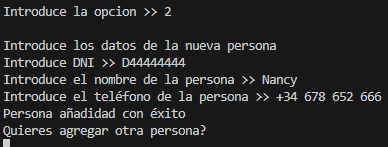

# JDBC GYM

1. Ejecutando el programa, nos pide que ingresemos la opcion a realizar 

2. 
a) Si seleccionamos en la opcion 1, podemos cargar los scripts que tenemos en DB_Data_Gym.sql para cargar los datos en la BBDD local
b) si tuviemos datos ingresados previamente, nos da un mensaje de "registros duplicados"

3. 
a) Con la opcion 2 podemos agregar nuevos registros a la tabla personas, si se introduce un dni equivocado, volvera a solicitar que se introduzca.
b) el sistema tambien preguntara si deseas volver a añadir otra persona.

4. 
a) Opcion 3, podemos paginar la salida de registros (inicialmente 10)
b) Si el usuario desea seguir viendo registros, podra indicarlo mediante consola (1x1)

5. Con la opcion 4, creamos un file xml donde nos da, de manera identada los registros de la tabla personas

6. En la opcion 5, podemos buscar registros de 2 maneras: por id y por LIKE

7. Con la opcion 6, realizamos un UPDATE de la base de datos, podemos escoger entre 2 campos: nombre y telefono

8. Por ultimo, en la opcion 8 podemos borrar un registro de la BBDD.